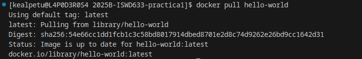
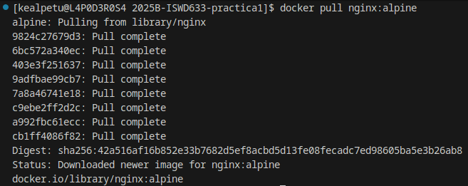
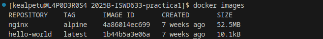
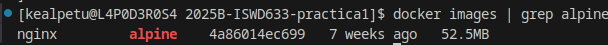
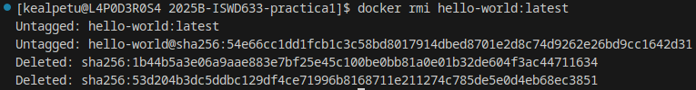
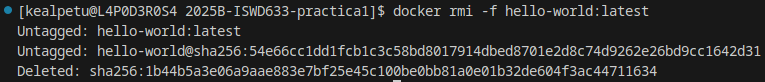

# Imagen
### Descargar imagen
Descarga la última versión de la imagen disponible en el registro de Docker.

```
docker pull <nombre imagen> 
```

Descarga una versión específica de la imagen, cada imagen tiene etiquetas (tags) para diferentes versiones.
Una imagen puede tener la etiqueta latest para representar la última versión, si no se especifica una etiqueta se hará referencia a la versión latest.

```
docker pull <nombre imagen>:<tag>
```

Descargar la imagen **hello-world**



# COMPLETAR

**¿Qué es nginx?**

**NGINX** (se pronuncia "engine-x") es un software de código abierto que funciona principalmente como:

1. **Servidor web** (como Apache),
2. **Proxy inverso**,
3. **Balanceador de carga**,
4. **Proxy de correo electrónico** (menos común).

---

### 🔧 ¿Para qué se usa NGINX?

1. **Servir sitios web estáticos** (HTML, imágenes, JS, CSS, etc.).
2. **Proxy inverso** para aplicaciones backend como Node.js, Python (Flask, Django), Ruby on Rails, etc.
3. **Balancear la carga** entre múltiples servidores backend.
4. **Aumentar el rendimiento y la seguridad** del servidor.
5. **Manejo eficiente de muchas conexiones simultáneas**, lo que lo hace ideal para sitios de alto tráfico.

---

### 🆚 NGINX vs Apache

| Característica | NGINX                                                 | Apache                       |
| -------------- | ----------------------------------------------------- | ---------------------------- |
| Arquitectura   | Asíncrona y basada en eventos                         | Basada en procesos o hilos   |
| Rendimiento    | Mejor con contenido estático y muchas conexiones      | Bueno con contenido dinámico |
| Configuración  | Más eficiente pero menos intuitiva para principiantes | Más flexible y conocido      |

---

### 💡 Ejemplo de uso básico

Archivo de configuración típico (`nginx.conf` o dentro de `sites-available`):

```nginx
server {
    listen 80;
    server_name midominio.com;

    location / {
        proxy_pass http://localhost:3000;
        proxy_set_header Host $host;
        proxy_set_header X-Real-IP $remote_addr;
    }
}
```

Este bloque configura NGINX para que escuche en el puerto 80 y redirija el tráfico a una aplicación que corre en el puerto 3000 (por ejemplo, una app Node.js).

# COMPLETAR 

Descargar la imagen  **nginx** en la versión **alpine**



# COMPLETAR

### Listar imágenes

```
docker images
```



# COLOCAR UNA CAPTURA DE PANTALLA DEL RESULTADO 

**Identificadores**

En Docker, se utilizan varios identificadores para diferenciar de manera única los elementos del sistema, como imágenes, contenedores, volúmenes y redes. Estos identificadores son generados automáticamente por Docker y son únicos dentro del contexto del sistema Docker en el que se encuentran. 

### Inspeccionar una imagen
El comando docker inspect se utiliza para obtener información detallada sobre un objeto de Docker específico, como un contenedor, una imagen, un volumen o una red.  Proporciona información en formato JSON sobre el objeto especificado.

```
docker inspect <nombre imagen>
docker inspect <nombre imagen>:<tag>
```

Inspeccionar la imagen hello-world 


# COMPLETAR

**¿Con qué algoritmo se está generando el ID de la imagen**

Con el algoritmo SHA256

# COMPLETAR

### Filtrar imágenes

```
docker images | grep <termino a buscar>

```



### Para eliminar una imagen
Eliminar permanentemente la imagen de tu sistema Docker.

```
docker rmi <nombre imagen>:<tag>
```

Eliminar la imagen hello-world 



# COMPLETAR

-f: Es la opción para forzar la eliminación de la imagen incluso si hay contenedores en ejecución que utilizan esa imagen.
Cuando eliminas una imagen Docker, Docker no elimina automáticamente los contenedores que se han creado a partir de esa imagen. Esto significa que, aunque hayas eliminado la imagen, el contenedor seguirá ejecutándose normalmente.  
**Considerar**
Eliminar una imagen no afecta a los contenedores que se han creado a partir de esa imagen, a menos que esos contenedores dependan de archivos o configuraciones específicas de la imagen eliminada. En ese caso, es posible que los contenedores se comporten de manera inesperada después de eliminar la imagen.
Es una buena práctica detener y eliminar todos los contenedores que dependan de una imagen antes de eliminar la imagen en sí.

```
docker rmi -f <nombre imagen>:<tag>
```

